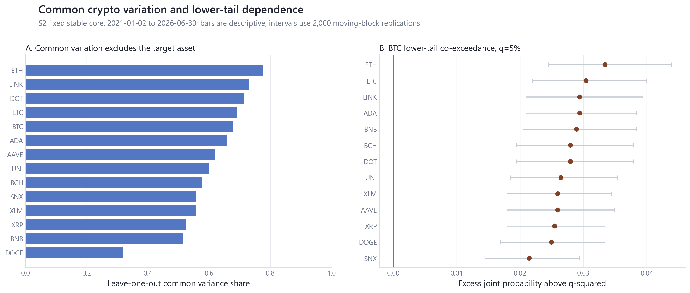
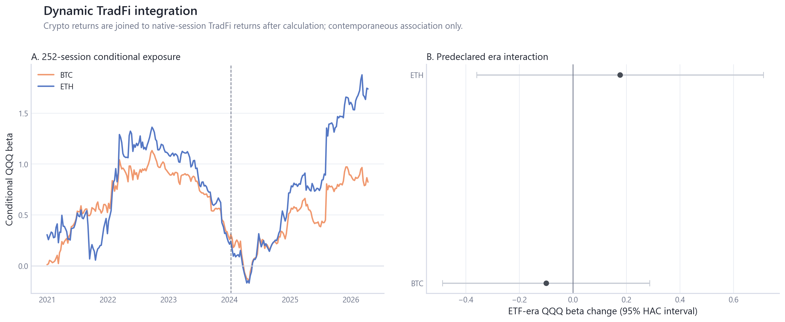
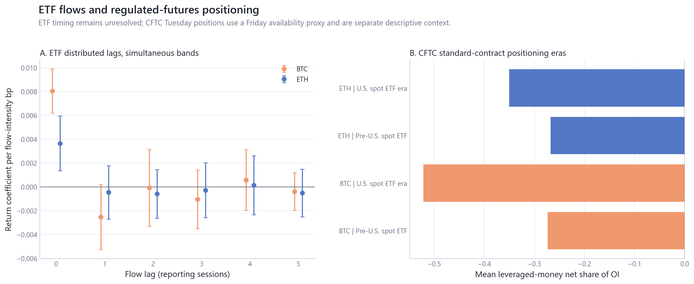
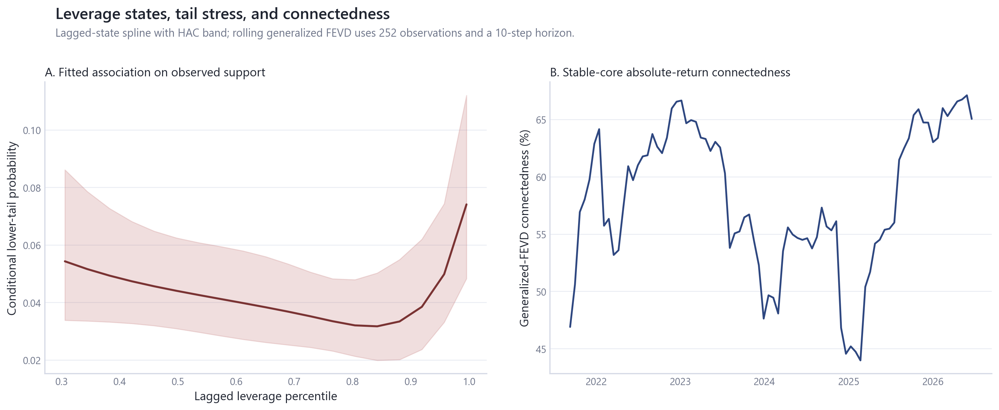
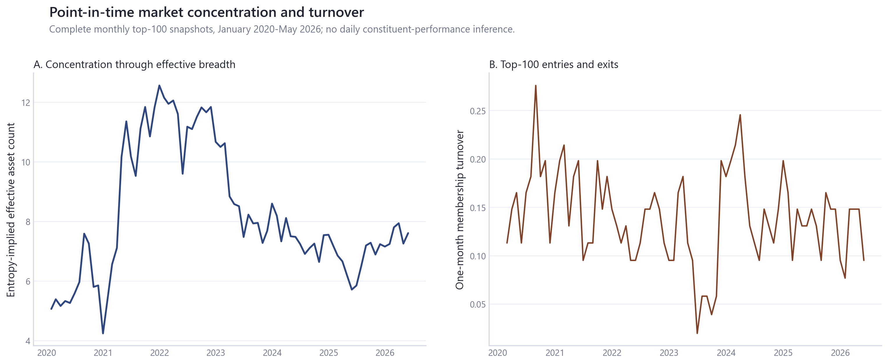
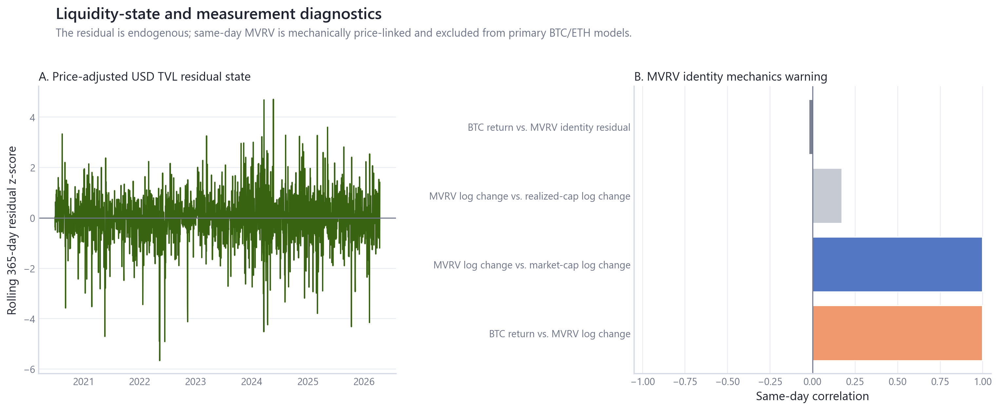
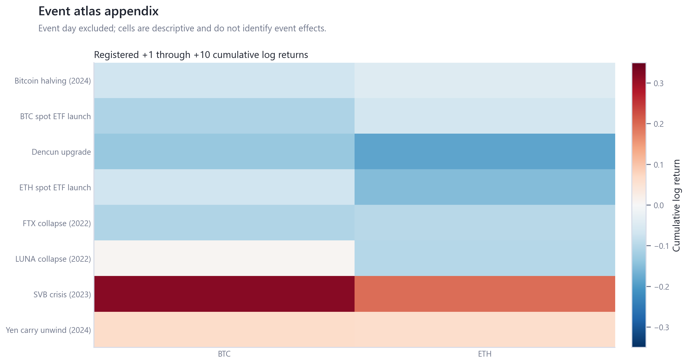

# Crypto Market Dynamics: Evidence Report

**Acquisition cutoff:** 2026-06-30<br>
**Estimator seed:** 20260713<br>
**Scope:** descriptive and associational empirical finance; no forecasting, trading strategy, portfolio-allocation, or causal claim.

## Study Design

The repository addresses four questions: realized crypto dependence and TradFi integration; institutional market plumbing; leverage, tails, and connectedness; and endogenous liquidity state with monthly point-in-time market structure. Inputs, timestamps, availability rules, transformations, denominators, missing-value rules, samples, estimands, and claims are registered under [`research/`](../research/README.md).

S1 covers BTC/ETH daily anchors. S2 fixes a January 2021 PIT-eligible stable core with at least 95% daily coverage. S3 is a supplementary unbalanced current-cohort panel and remains survivorship-biased. S4 is monthly point-in-time top-100 structure through the last complete month. S5 begins each ETF or institutional series at its actual reporting inception.

The primary uncertainty procedures are HAC covariance and deterministic moving-block bootstrap inference. Same-day MVRV is excluded from primary BTC/ETH models. ETF flows, stablecoin supply, and DeFi TVL are endogenous market-state measures.

## Estimands and Equations

| Quantity | Definition | Interpretation boundary |
|---|---|---|
| Log return | `r[i,t] = log(P[i,t] / P[i,t-1])` on the series' native calendar before joins | Realized return, not a forecast target. |
| Leave-one-out common factor | First PC of standardized S2 returns excluding asset `i`; `r[i,t] = alpha + beta * PC1[-i,t] + error` | Descriptive common variation without mechanical self-inclusion. |
| Tail excess | `Pr(r[i] <= Q[i,q], r[j] <= Q[j,q]) - q^2` | Co-exceedance relative to independence, not causal contagion. |
| ETF distributed lag | `y[t] = alpha + sum(k=0..5) beta[k] * flow_bps[t-k] + error[t]` | Timing-sensitive association; flow uses lagged market capitalization. |
| Leverage tail model | `logit Pr(r[t+1] <= Q[0.05]) = spline(leverage[t-1]) + spline(volatility[t-1])` | Conditional association, not a prediction rule. |
| Generalized FEVD connectedness | Off-diagonal generalized forecast-error variance shares divided by total shares | Descriptive stress connectedness; variable-order sensitivity is reported. |
| PIT structure | `HHI[t] = sum(i) share[i,t]^2`; entropy breadth `= exp(-sum(i) share[i,t] * log(share[i,t]))`; turnover `= (entries + exits) / size(union of adjacent memberships)` | Monthly composition only; no daily constituent-return inference. |
| Liquidity residual | Residual from HAC regression of log USD TVL growth on BTC, ETH, and TOTAL3 returns | Endogenous state proxy, not an exogenous liquidity shock. |
| MVRV identity | `d log MVRV = d log market cap - d log realized cap + residual` | Measurement-mechanics diagnostic excluded from primary return models. |

## 01. Cross-Asset Dependence and Regimes



**Result.** Within S2, the median leave-one-out common-variance share is 61.0%, while median 5% lower-tail co-exceedance is 2.8% above the independence benchmark.

**Sample.** 2021-01-02 to 2026-06-30, n=2006

**Method and uncertainty.** Leave-one-out PCA/HAC factor regressions and moving-block tail inference. Intervals, diagnostics, and sensitivity specifications are reported in the linked source tables.

**Evidence grade.** B. **Limitation.** S2 is a fixed 2021 PIT-eligible universe; results do not establish causation, forecasting value, or investability.

**Provenance.** [Primary source table](../research/01_cross_asset_dependence_regimes/tables/common_factor_results.csv); [module documentation](../research/01_cross_asset_dependence_regimes/README.md).

## 02. Macro and TradFi Integration



**Result.** Conditional QQQ exposure estimates differ across the predeclared BTC ETF-era split: BTC 1.03 to 0.93 (change p=0.611); ETH 1.33 to 1.51 (change p=0.520).

**Sample.** 2020-01-03 to 2026-04-14, n=1577

**Method and uncertainty.** 252-session multivariate HAC exposures and formal era interactions. Intervals, diagnostics, and sensitivity specifications are reported in the linked source tables.

**Evidence grade.** B. **Limitation.** The split is descriptive; contemporaneous exposures do not identify ETF effects or causal transmission.

**Provenance.** [Primary source table](../research/02_macro_tradfi_integration/tables/dynamic_tradfi_exposures.csv); [module documentation](../research/02_macro_tradfi_integration/README.md).

## 04. ETF and Institutional Flows



**Result.** Across 12 asset-lag return coefficients, 2 have 95% moving-block simultaneous intervals excluding zero under the reported-date convention. Simultaneity prevents a price-impact interpretation.

**Sample.** 2024-01-22 to 2026-04-10, n=426-557

**Method and uncertainty.** Distributed-lag HAC OLS with moving-block simultaneous bands; CFTC positioning is separate contemporaneous context. Intervals, diagnostics, and sensitivity specifications are reported in the linked source tables.

**Evidence grade.** B. **Limitation.** ETF reporting time is unresolved, CFTC data is weekly and released after the as-of date, and neither design identifies causality.

**Provenance.** [Primary source table](../research/04_etf_institutional_flows/tables/etf_distributed_lags.csv); [module documentation](../research/04_etf_institutional_flows/README.md).

## 03. Derivatives, Leverage, and Liquidations



**Result.** Across observed support, lagged BTC leverage states coincide with fitted next-session lower-tail probabilities from 3.2% to 7.4%.

**Sample.** 2020-02-01 to 2026-04-12, n=2263

**Method and uncertainty.** Spline logistic association with HAC covariance, quantile/ES diagnostics, and generalized-FEVD connectedness. Intervals, diagnostics, and sensitivity specifications are reported in the linked source tables.

**Evidence grade.** B. **Limitation.** The relationship is associational, nonlinear, and not a forecast, trading signal, or liquidation-cause estimate.

**Provenance.** [Primary source table](../research/03_derivatives_leverage_liquidations/tables/leverage_tail_model.csv); [module documentation](../research/03_derivatives_leverage_liquidations/README.md).

## 07. Chain Fundamentals and Sector Dynamics



**Result.** Across complete monthly PIT snapshots, effective asset count changed from 5.1 to 7.6, while median one-month membership turnover was 14.8%.

**Sample.** January 2020 to May 2026; 77 complete monthly snapshots; 7,700 top-100 asset-months

**Method and uncertainty.** Monthly point-in-time concentration, entropy, effective count, membership transition, and exact HHI decomposition. Intervals, diagnostics, and sensitivity specifications are reported in the linked source tables.

**Evidence grade.** B. **Limitation.** Monthly snapshots support market-structure statements only; they do not establish daily constituent performance or historical altseason behavior.

**Provenance.** [Primary source table](../research/07_chain_fundamentals_sector_dynamics/tables/pit_concentration.csv); [module documentation](../research/07_chain_fundamentals_sector_dynamics/README.md).

## 05. Stablecoin and DeFi Liquidity State



**Result.** Crypto-market return controls explain 0.4% of daily raw USD TVL growth in the stated HAC residualization; the remaining series is an endogenous liquidity-state proxy.

**Sample.** 2020-01-02 to 2026-04-14, n=2295

**Method and uncertainty.** HAC residualization of USD TVL growth; MVRV identity audit is appendix measurement evidence. Intervals, diagnostics, and sensitivity specifications are reported in the linked source tables.

**Evidence grade.** B. **Limitation.** USD TVL remains valuation-sensitive, stablecoin and TVL measures are endogenous, and same-day MVRV is mechanically price-linked.

**Provenance.** [Primary source table](../research/05_stablecoin_defi_liquidity/tables/liquidity_state.csv); [module documentation](../research/05_stablecoin_defi_liquidity/README.md).

## 09. Event Stress and Cross-Module Synthesis



**Result.** Registered event-window responses vary substantially across events and assets and remain appendix sensitivity evidence rather than causal estimates.

**Sample.** 8 events x 2 assets x 3 horizons = 48 event-asset-horizon estimates; BTC/ETH return support 2020-01-02 to 2026-04-14; placebo windows 212-2270

**Method and uncertainty.** Fixed post-event windows with empirical non-event-window comparison and cross-module claim ledger. Intervals, diagnostics, and sensitivity specifications are reported in the linked source tables.

**Evidence grade.** B. **Limitation.** Event windows are not an identification design; overlapping market developments and event selection constrain interpretation.

**Provenance.** [Primary source table](../research/09_event_stress_cross_module_synthesis/tables/event_response_matrix.csv); [module documentation](../research/09_event_stress_cross_module_synthesis/README.md).

## Cross-Module Assessment

The strongest descriptive evidence concerns broad common crypto variation, lower-tail co-exceedance above independence, time-varying cross-market exposure, nonlinear leverage-state associations, and changing monthly market breadth and turnover. Formal TradFi era interactions are weak, most ETF lag coefficients do not clear simultaneous bands, and USD TVL residualization has low explanatory power. Those weak results are retained without specification search.

## Reproducibility

```bash
uv sync --all-extras
uv run python scripts/run_all.py --mode local
uv run python scripts/execute_reproducibility_notebook.py
uv run python scripts/build_report.py
uv run python scripts/check_research_surface.py --module all
```

Public CI runs fixture scientific smoke tests and validates committed semantic outputs without requiring local provider exports. A full local build requires legally obtained inputs under `data_local/raw/` or an external read-only `CMD_DATA_ROOT`.

## References

Source attribution, event provenance, and econometric references are maintained in [`REFERENCES.md`](../REFERENCES.md). Source eligibility and fallback decisions are in [`research/source_decisions.csv`](../research/source_decisions.csv).
